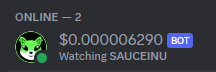

# Discord-Sidebar-Price-Bot
These Python scripts can run Discord bots that pull live data at intervals and display it on the sidebar of a Discord guild (i.e. server).
- **Cryptocurrency price** data (in USD) from Saucerswap API
## Getting Started
- Clone Repository and run `pip install -r requirements.txt` in your terminal. This was ran in python 3.9, it would be best to run it with that.
- The crytpo_config.yaml file is already configured to run for SAUCEINU, but you can set up multiple tokens in the config. More options can be added if you follow the pattern.
  - Ticker - (case sensitive)
  - decimalPlace - Amount of decimals you wish to see on the bot
  - updateFreq - Frequency in seconds that the python code will fetch the price data from saucerswap (default 60)
  - discordBotKey - Create your discord bot and insert the key here
  - guildId - Insert your server id aka guild id here.
- Build a discord bot per ticker you wish to run against, and ensure you add the bot to the server as well.
  - Refer to this documentation for giving your bot access to servers if required: https://discordpy.readthedocs.io/en/stable/discord.html
- Ensure to enable the following for your bot:
  
- Once your bot and the crypto_config.yaml is setup you are now ready to test.
- Open terminal and you can run the following python command `python crypto_run.py -t SAUCEINU`
- If everything works your bot should look something like this (I added the image to the bot creation myself, you'll need to do this as well) 

- If you want to setup additional bots follow the same format above but when you run the python code ensure to reference another ticker 
- eg. `python crypto_run.py -t TOKENNAME`

- This repo is simple fork and has been significantly stripped down from https://github.com/edenau/discord-sidebar-price-bot
